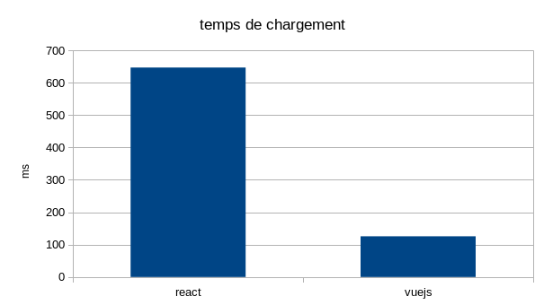
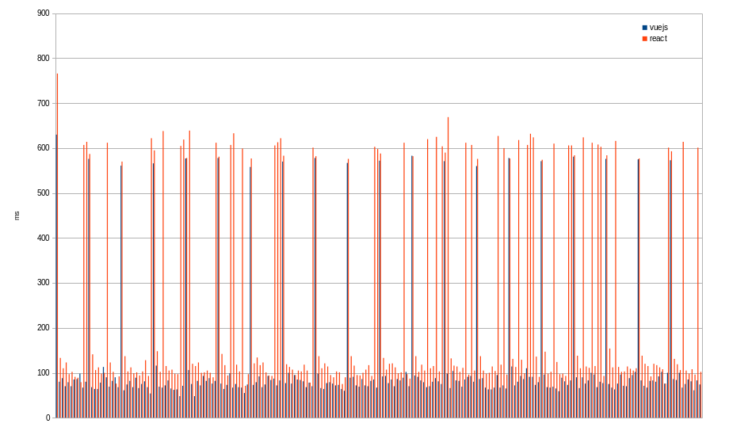

Cette page a pour but de résumer les tests comparatifs entre vuejs et react.

Nous avons fait deux applications identiques avec les fonctionalités suivantes :

* chargement d'une liste de mail
* chargement d'un mail lorsque l'on clique sur un mail de la liste

Nous utilisons l'injecteur [jmeter](https://jmeter.apache.org/) avec le plugin selenium [WebDriver](https://jmeter-plugins.org/wiki/WebDriverTutorial/). Jmeter lance un navigateur et va exécuter le script selenium.

Nous réglons un scénario qui charge la page d'accueil, puis clique sur 10 mails au hasard dans la liste. Nous faisons répérer ce scénario 20 fois.

## 1er tir

nous obtenons une moyenne de 655ms pour react et 130ms pour vuejs.

La différence est trop importante. En observant de plus près l'application vuejs, nous nous rendons compte que les mails sont juste affichés (titre, date) mais le coprs de chaque message n'est pas chargé (la requête ajax n'est pas exécutée).

Par ailleurs, le délai de chargement des pages est assez long : le backend est hébergé chez heroku. Pour diminuer les aléas et les délais de chargement du réseau, nous décidons de faire tourner l'application en local.

## 2e tir

Le tir est correct. Nous voyons bien les pics de chaque chargement de la page d'accueil et les temps plus réduits liés aux 10 affichages de mail.

|   |react | vuejs
| ---| --- | ------
| moyenne    | 249 | 124
| écart type | 255 | 143

A présent essayons de voir plus précisément comment le temps est passé par le navigateur, et quelle est la charge induite par l'exécution du javascript.
