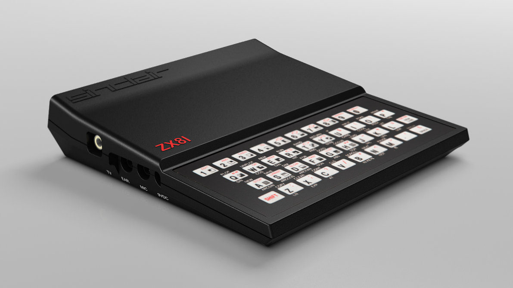
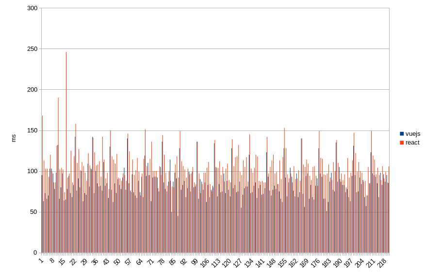
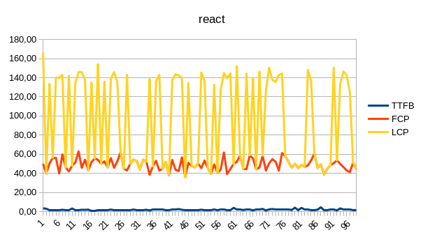
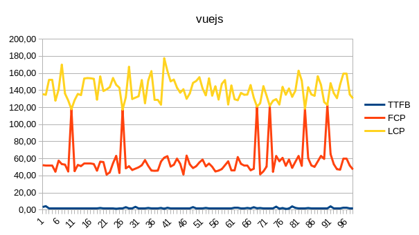
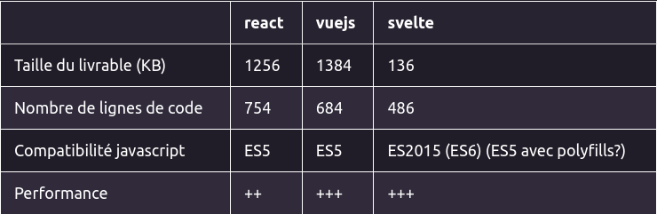
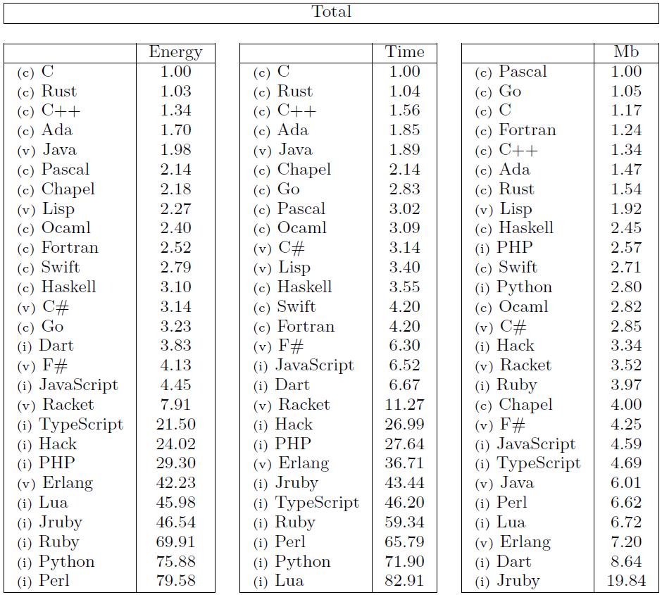
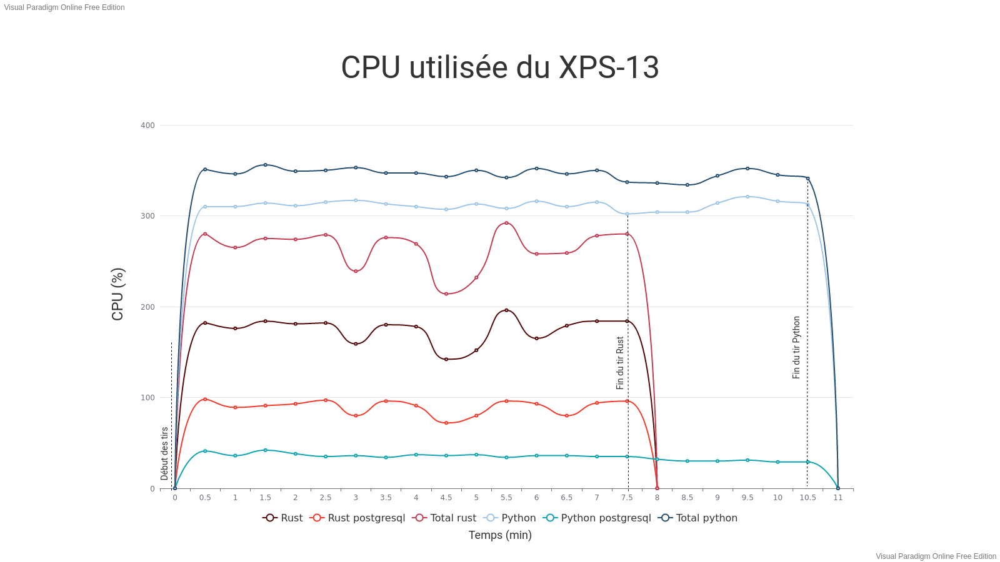
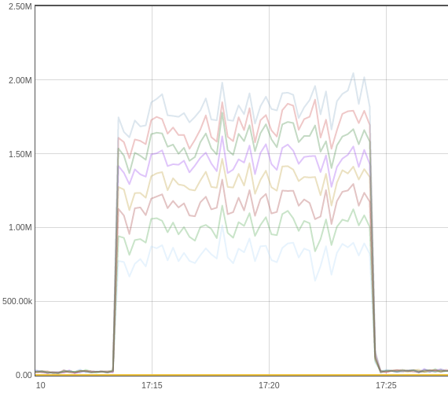
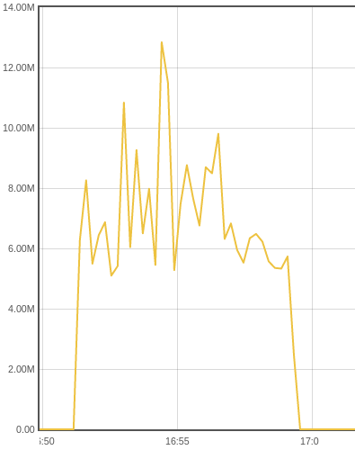

class: center, middle
.header[]

# Les tests de charge
une boussole pour l'architecte ?


Bruno Thomas - Iroco.co - @bam_thomas
---
class: center, middle
.header[]

<h3>D'où je parle ?</h3>

---
class: center, middle
.header[]

### "*Un problème c'est un écart entre une réalité observée et une réalité souhaitée*"
      -- Lean management

### "*Sans mesure, aucune amélioration n'est possible*"
      -- Lord Kelvin

---
class: middle, center
.header[]

# Empreinte Carbone

<svg xmlns:xlink="http://www.w3.org/1999/xlink" version="1.1" class="highcharts-root" style="font-family:;font-size:12px;" xmlns="http://www.w3.org/2000/svg" width="300" height="300" viewBox="0 0 300 300"><desc>Created with Highcharts 9.1.0</desc><defs><clipPath id="highcharts-7cbwwdf-352-"><rect x="0" y="0" width="280" height="239" fill="none"></rect></clipPath></defs><rect fill="none" class="highcharts-background" x="0" y="0" width="300" height="300" rx="0" ry="0"></rect><rect fill="none" class="highcharts-plot-background" x="10" y="46" width="280" height="239"></rect><g class="highcharts-pane-group" data-z-index="0"></g><rect fill="none" class="highcharts-plot-border" data-z-index="1" x="10" y="46" width="280" height="239"></rect><g class="highcharts-series-group" data-z-index="3"><g class="highcharts-series highcharts-series-0 highcharts-pie-series" data-z-index="0.1" opacity="1" transform="translate(10,46) scale(1 1)"><path fill="#94d13d" d="M 139.9817508809489 29.900001858428297 A 89.6 89.6 0 0 1 213.0793635782946 67.65825409005373 L 140 119.5 A 0 0 0 0 0 140 119.5 Z" transform="translate(0,0)" stroke="#ffffff" stroke-width="1" opacity="1" stroke-linejoin="round" class="highcharts-point highcharts-color-0"></path><path fill="#6f58e9" d="M 213.1311687758855 67.73135936232293 A 89.6 89.6 0 1 1 137.09845472872865 29.946993154675354 L 140 119.5 A 0 0 0 1 0 140 119.5 Z" transform="translate(0,0)" stroke="#ffffff" stroke-width="1" opacity="1" stroke-linejoin="round" class="highcharts-point highcharts-color-1"></path><path fill="#2d99fe" d="M 137.18800917142104 29.94413638638737 A 89.6 89.6 0 0 1 139.8755473975488 29.900086431125715 L 140 119.5 A 0 0 0 0 0 140 119.5 Z" transform="translate(0,0)" stroke="#ffffff" stroke-width="1" opacity="1" stroke-linejoin="round" class="highcharts-point highcharts-color-2"></path></g><g class="highcharts-markers highcharts-series-0 highcharts-pie-series" data-z-index="0.1" opacity="1" transform="translate(10,46) scale(1 1)"></g></g><text x="150" text-anchor="middle" class="highcharts-title" data-z-index="4" style="color:white;font-size:18px;fill:white;" y="24">R740</text><text x="150" text-anchor="middle" class="highcharts-subtitle" data-z-index="4" style="color:#666666;fill:#666666;" y="45"></text><text x="10" text-anchor="start" class="highcharts-caption" data-z-index="4" style="color:#666666;fill:#666666;" y="297"></text><g class="highcharts-data-labels highcharts-series-0 highcharts-pie-series" data-z-index="6" opacity="1" transform="translate(10,46) scale(1 1)"><path fill="none" class="highcharts-data-label-connector highcharts-color-0" stroke="#94d13d" stroke-width="1" d="M 199.9608069431478 13.276322318618455 C 194.9608069431478 13.276322318618455 186.68911359050014 29.26316344123441 183.93188247295092 34.59211048210639 L 181.1746513554017 39.92105752297837"></path><path fill="none" class="highcharts-data-label-connector highcharts-color-1" stroke="#6f58e9" stroke-width="1" d="M 81.70686973670081 226.57008109989934 C 86.70686973670081 226.57008109989934 94.72757496027425 210.45585484740616 97.40114336813207 205.08444609657508 L 100.07471177598988 199.713037345744"></path><path fill="none" class="highcharts-data-label-connector highcharts-color-2" stroke="#2d99fe" stroke-width="1" d="M 133.1298849080418 0 C 138.1298849080418 0 138.41134035666448 17.912421229081183 138.50515883953864 23.91168769193072 L 138.5989773224128 29.910954154780256"></path><g class="highcharts-label highcharts-data-label highcharts-data-label-color-0" data-z-index="1" style="cursor:pointer;" transform="translate(205,3)"><text x="5" data-z-index="1" y="16" style="color:white;font-size:11px;font-weight:bold;fill:white;"><title>Manufacturing: 15.2 %</title><tspan style="font-weight:bold;">Manufact.</tspan>: 15.2 %</text></g><g class="highcharts-label highcharts-data-label highcharts-data-label-color-1" data-z-index="1" style="cursor:pointer;" transform="translate(3,217)"><text x="5" data-z-index="1" y="16" style="color:white;font-size:11px;font-weight:bold;fill:white;"><tspan style="font-weight:bold;">Use</tspan>: 84.3 %</text></g><g class="highcharts-label highcharts-data-label highcharts-data-label-color-2" data-z-index="1" style="cursor:pointer;" transform="translate(46,-10)"><text x="5" data-z-index="1" y="16" style="color:white;font-size:11px;font-weight:bold;fill:white;"><tspan style="font-weight:bold;">Transp. | EoL</tspan>:<tspan dy="14" x="5"></tspan>0.5 %</text></g></g><g class="highcharts-legend" data-z-index="7"><rect fill="none" class="highcharts-legend-box" rx="0" ry="0" x="0" y="0" width="8" height="8" visibility="hidden"></rect><g data-z-index="1"><g></g></g></g><text x="290" class="highcharts-credits" text-anchor="end" data-z-index="8" style="cursor:pointer;color:#999999;font-size:9px;fill:#999999;" y="295">Highcharts.com</text></svg>
<svg version="1.1" style="font-family:;font-size:12px;" xmlns="http://www.w3.org/2000/svg" width="54" height="100" viewBox="0 0 54 54"><defs><clipPath ><rect x="0" y="0" width="34" height="75" fill="none"></rect></clipPath></defs><rect fill="none" x="0" y="0" width="54" height="100" rx="0" ry="0"></rect><rect fill="none" x="10" y="10" width="34" height="75"></rect><g data-z-index="0"></g><rect fill="none" data-z-index="1" x="10" y="10" width="34" height="75"></rect><g data-z-index="3"><g data-z-index="0.1" opacity="1" transform="translate(10,10) scale(1 1)" style="cursor:pointer;"><path fill="#94d13d" d="M 16.998452083651916 29.900000157634544 A 7.6 7.6 0 1 1 10.361241177602071 33.80042147021668 L 11.23476207528601 34.287208118872385 A 6.6 6.6 0 1 0 16.998655756855612 30.900000136893155 Z" data-z-index="-1" fill-opacity="0.25" visibility="hidden"></path><path fill="rgb(148,209,61)" d="M 16.998452083651916 29.900000157634544 A 7.6 7.6 0 1 1 10.361241177602071 33.80042147021668 L 17 37.5 A 0 0 0 1 0 17 37.5 Z" transform="translate(0,0)" stroke="#ffffff" stroke-width="1" opacity="1" stroke-linejoin="round" ></path><path fill="rgb(111,88,233)" d="M 10.364944074894392 33.79378456228986 A 7.6 7.6 0 0 1 14.918775151533065 30.190519640212187 L 17 37.5 A 0 0 0 0 0 17 37.5 Z" transform="translate(0,0)" stroke="#ffffff" stroke-width="1" opacity="1" stroke-linejoin="round" ></path><path fill="#2d99fe" d="M 14.926085671286947 30.188442070450463 A 7.6 7.6 0 0 1 16.989443752470656 29.900007331211555 L 17 37.5 A 0 0 0 0 0 17 37.5 Z" transform="translate(0,0)" stroke="#ffffff" stroke-width="1" opacity="1" stroke-linejoin="round" ></path></g><g data-z-index="0.1" opacity="1" transform="translate(10,10) scale(1 1)"></g></g><g data-z-index="3"><g stroke-linecap="round" style="cursor:pointer;" transform="translate(20,10)"><title>Chart context menu</title></g></g><text font-family='-Regular,' x="27" text-anchor="middle" data-z-index="4" style="color:#333333;font-size:18px;fill:#333333;" y="24"></text><text font-family='-Regular,' x="27" text-anchor="middle" data-z-index="4" style="color:#666666;fill:#666666;" y="24"></text><text font-family='-Regular,' x="10" text-anchor="start" data-z-index="4" style="color:#666666;fill:#666666;" y="97"></text><g data-z-index="7"><rect fill="none" rx="0" ry="0" x="0" y="0" width="8" height="8" visibility="hidden"></rect><g data-z-index="1"><g></g></g></g></svg>
<svg xmlns:xlink="http://www.w3.org/1999/xlink" version="1.1" class="highcharts-root" style="font-family:;font-size:12px;" xmlns="http://www.w3.org/2000/svg" width="300" height="300" viewBox="0 0 300 300"><desc>Created with Highcharts 9.1.0</desc><defs><clipPath id="highcharts-7cbwwdf-395-"><rect x="0" y="0" width="280" height="239" fill="none"></rect></clipPath></defs><rect fill="none" class="highcharts-background" x="0" y="0" width="300" height="300" rx="0" ry="0"></rect><rect fill="none" class="highcharts-plot-background" x="10" y="46" width="280" height="239"></rect><g class="highcharts-pane-group" data-z-index="0"></g><rect fill="none" class="highcharts-plot-border" data-z-index="1" x="10" y="46" width="280" height="239"></rect><g class="highcharts-series-group" data-z-index="3"><g class="highcharts-series highcharts-series-0 highcharts-pie-series" data-z-index="0.1" opacity="1" transform="translate(10,46) scale(1 1)"><path fill="#94d13d" d="M 139.9817508809489 29.900001858428297 A 89.6 89.6 0 1 1 61.73252756751917 75.88391628044934 L 140 119.5 A 0 0 0 1 0 140 119.5 Z" transform="translate(0,0)" stroke="#ffffff" stroke-width="1" opacity="1" stroke-linejoin="round" class="highcharts-point highcharts-color-0"></path><path fill="#6f58e9" d="M 61.77618277770233 75.80567062910148 A 89.6 89.6 0 0 1 115.46345441807404 33.325073653027886 L 140 119.5 A 0 0 0 0 0 140 119.5 Z" transform="translate(0,0)" stroke="#ffffff" stroke-width="1" opacity="1" stroke-linejoin="round" class="highcharts-point highcharts-color-1"></path><path fill="#2d99fe" d="M 115.54964159833033 33.30058019899495 A 89.6 89.6 0 0 1 139.8755473975488 29.900086431125715 L 140 119.5 A 0 0 0 0 0 140 119.5 Z" transform="translate(0,0)" stroke="#ffffff" stroke-width="1" opacity="1" stroke-linejoin="round" class="highcharts-point highcharts-color-2"></path></g><g class="highcharts-markers highcharts-series-0 highcharts-pie-series" data-z-index="0.1" opacity="1" transform="translate(10,46) scale(1 1)"></g></g><text x="150" text-anchor="middle" class="highcharts-title" data-z-index="4" style="color:white;font-size:18px;fill:white;" y="24">XPS 13</text><text x="150" text-anchor="middle" class="highcharts-subtitle" data-z-index="4" style="color:#666666;fill:#666666;" y="45"></text><text x="10" text-anchor="start" class="highcharts-caption" data-z-index="4" style="color:#666666;fill:#666666;" y="297"></text><g class="highcharts-data-labels highcharts-series-0 highcharts-pie-series" data-z-index="6" opacity="1" transform="translate(10,46) scale(1 1)"><path fill="none" class="highcharts-data-label-connector highcharts-color-0" stroke="#94d13d" stroke-width="1" d="M 205.53136993534326 222.65092463836967 C 200.53136993534326 222.65092463836967 191.4212975370475 207.12653798711 188.38460673761557 201.95174243669013 L 185.34791593818363 196.77694688627025"></path><path fill="none" class="highcharts-data-label-connector highcharts-color-1" stroke="#6f58e9" stroke-width="1" d="M 47.467663118136755 38 C 52.467663118136755 38 77.01540707714284 39.778603534923135 80.73496965132732 44.48656001908122 L 84.4545322255118 49.1945165032393"></path><path fill="none" class="highcharts-data-label-connector highcharts-color-2" stroke="#2d99fe" stroke-width="1" d="M 118.55045613411134 0 C 123.55045613411134 0 126.02613999352599 18.86555641074242 126.85136794666421 24.808535362863932 L 127.67659589980244 30.751514314985442"></path><g class="highcharts-label highcharts-data-label highcharts-data-label-color-0" data-z-index="1" style="cursor:pointer;" transform="translate(211,213)"><text x="5" data-z-index="1" y="16" style="color:white;font-size:11px;font-weight:bold;fill:white;"><title>Manufacturing: 83.1 %</title><tspan style="font-weight:bold;">Manufact.</tspan>: 83.1 %</text></g><g class="highcharts-label highcharts-data-label highcharts-data-label-color-1" data-z-index="1" style="cursor:pointer;" transform="translate(-10,28)"><text x="5" data-z-index="1" y="16" style="color:white;font-size:11px;font-weight:bold;fill:white;"><title>Use: 12.5 %</title><tspan style="font-weight:bold;">Use</tspan>: 12.…</text></g><g class="highcharts-label highcharts-data-label highcharts-data-label-color-2" data-z-index="1" style="cursor:pointer;" transform="translate(31,-10)"><text x="5" data-z-index="1" y="16" style="color:white;font-size:11px;font-weight:bold;fill:white;"><tspan style="font-weight:bold;">Transp. | EoL</tspan>:<tspan dy="14" x="5"></tspan>4.4 %</text></g></g><g class="highcharts-legend" data-z-index="7"><rect fill="none" class="highcharts-legend-box" rx="0" ry="0" x="0" y="0" width="8" height="8" visibility="hidden"></rect><g data-z-index="1"><g></g></g></g></svg>

* laptop Dell XPS 13 9370 : total 297 kgCO2eq
* Dell Power Edge R740 : total 8640 kgCO2eq 

*source Boavizta/ADEME*
---
name: content
.header[]
.spacer[]

# Des questions de dev
--
count: false
* lequel de tel ou tel framework Javascript est plus performant ? 
--
count: false
* quel langage utiliser pour être le plus efficace côté serveur ?
--
count: false
* est-ce qu'il faut faire du rendu serveur, du rendu client du cache, du pré-rendu ?
--
count: false
* pour mon service de calendrier/contact vaut-il mieux un stockage en BDD ou en fichier sur disque ?
--
count: false
* cache serveur ou cache client ?
--
count: false
* vaut-il mieux une application native ou une app web ?
--
count: false
* quelles différences entre la programmation asynchrone et synchrone ?
--
count: false
* est-ce que les promesses de performances de [io_uring](https://unixism.net/2020/04/io-uring-by-example-part-1-introduction/) vont m'être utiles ? 
* etc.
---
class: center, middle
.header[]

# Benchmark Client Web

---
class: middle
.header[]

# Objectif

* quelles sont les différences de performance entre vuejs/react/svelte ?
  * ajouter un outil à notre boite à outils
  * faire un choix de frameworks web JS

---
class: middle
.header[]

# Architecture


---
class: middle
.header[]


* injecteur écrit en java (déployable sur plusieurs noeuds)
* UX un peu "brut"
* dernière version plus design mais des concepts à découvrir
* plein de plugins dont [WebDriver](https://jmeter-plugins.org/wiki/WebDriverTutorial/)

cf https://jmeter.apache.org/
---
class: middle
.header[]

<a href="https://www.selenium.dev/">
  <svg alt="selenium-logo" data-name="Selenium Logo" xmlns="http://www.w3.org/2000/svg" viewBox="0 0 139.38 34"><defs><style>.cls-selenium_logo{fill:#fff}</style></defs><title>Selenium</title><path class="cls-selenium_logo" d="M46.2 26.37a18.85 18.85.0 01-2.57-.2 25 25 0 01-2.74-.53v-1.39a25.31 25.31.0 002.71.53 18 18 0 002.5.2 5.51 5.51.0 003.29-.84 2.79 2.79.0 001.14-2.39 2.85 2.85.0 00-1.24-2.49A6 6 0 0048 18.55q-.78-.29-1.67-.55A15.93 15.93.0 0144 17.13a5.92 5.92.0 01-1.58-1.05 3.6 3.6.0 01-.9-1.34A5 5 0 0141.23 13a4.46 4.46.0 01.41-1.93 4.31 4.31.0 011.17-1.5 5.26 5.26.0 011.82-1A8 8 0 0147 8.28a20.51 20.51.0 014.41.57v1.42a20 20 0 00-2.23-.44 15.2 15.2.0 00-2-.15 4.86 4.86.0 00-3.08.9A2.9 2.9.0 0042.88 13a3.25 3.25.0 00.21 1.21 2.61 2.61.0 00.7 1 4.83 4.83.0 001.27.79 14.31 14.31.0 002 .68q1.11.33 2.06.71a6.21 6.21.0 011.65.94 4.09 4.09.0 011.1 1.38 4.54 4.54.0 01.4 2 4.15 4.15.0 01-1.56 3.48A7.16 7.16.0 0146.2 26.37z"></path><path class="cls-selenium_logo" d="M60.62 26.32a5.46 5.46.0 01-4.28-1.62A6.9 6.9.0 0154.88 20a7.8 7.8.0 011.43-5 5 5 0 014.14-1.75 4.24 4.24.0 013.47 1.43A6.48 6.48.0 0165.1 18.8q0 .54.0.92a3.22 3.22.0 01-.09.64H56.44a5.39 5.39.0 001.17 3.5A4.18 4.18.0 0060.8 25a10.52 10.52.0 001.82-.17 11.77 11.77.0 001.93-.52l.12 1.27a10.68 10.68.0 01-2 .55A11.47 11.47.0 0160.62 26.32zM60.4 14.43q-3.68.0-3.94 4.74h7.15a6.49 6.49.0 00-.78-3.63A2.76 2.76.0 0060.4 14.43z"></path><path class="cls-selenium_logo" d="M68.64 7h1.58V26.11H68.64z"></path><path class="cls-selenium_logo" d="M79.56 26.32a5.46 5.46.0 01-4.28-1.62A6.9 6.9.0 0173.83 20a7.8 7.8.0 011.43-5 5 5 0 014.14-1.75 4.24 4.24.0 013.47 1.43A6.48 6.48.0 0184 18.8q0 .54.0.92a3.22 3.22.0 01-.09.64H75.38a5.4 5.4.0 001.17 3.5A4.18 4.18.0 0079.75 25a10.52 10.52.0 001.82-.17 11.8 11.8.0 001.93-.52l.12 1.27a10.68 10.68.0 01-2 .55A11.47 11.47.0 0179.56 26.32zm-.21-11.89q-3.68.0-3.94 4.74h7.15a6.49 6.49.0 00-.78-3.63A2.76 2.76.0 0079.35 14.43z"></path><path class="cls-selenium_logo" d="M87.51 13.37h1.32l.12 1.49h.12q.94-.45 1.72-.78t1.43-.54a8.42 8.42.0 011.2-.31 6.54 6.54.0 011.1-.09A3.3 3.3.0 0197 14a3.63 3.63.0 01.83 2.63v9.51H96.24v-9a3 3 0 00-.55-2 2.18 2.18.0 00-1.69-.6 7.25 7.25.0 00-2.24.41 20.1 20.1.0 00-2.67 1.12v10H87.51z"></path><path class="cls-selenium_logo" d="M102.75 10.52a.93.93.0 01-1.06-1 1.06 1.06.0 012.12.0.93.93.0 01-1.06 1zm-.8 2.85h1.58V26.11h-1.58z"></path><path class="cls-selenium_logo" d="M110.81 26.34q-3.14.0-3.14-3.47v-9.5h1.58v9a3.16 3.16.0 00.48 2 1.92 1.92.0 001.59.6 6.83 6.83.0 002.48-.48q1.25-.48 2.59-1.14V13.37H118V26.11h-1.32l-.12-1.58h-.09l-1.73.81q-.74.34-1.38.57a7.9 7.9.0 01-1.23.33A7.34 7.34.0 01110.81 26.34z"></path><path class="cls-selenium_logo" d="M122.18 13.37h1.3l.14 1.49h.09a19.53 19.53.0 012.58-1.31 5.51 5.51.0 012-.41 2.83 2.83.0 013 1.77h.12q.8-.5 1.45-.83a12.61 12.61.0 011.2-.54 6.17 6.17.0 011-.31 5.18 5.18.0 011-.09 3.3 3.3.0 012.45.84 3.63 3.63.0 01.83 2.63v9.51h-1.56v-9a2.9 2.9.0 00-.55-2 2.21 2.21.0 00-1.69-.59 5.14 5.14.0 00-1.78.38A14.45 14.45.0 00131.6 16v10.1H130v-9a2.9 2.9.0 00-.55-2 2.21 2.21.0 00-1.69-.59 5.24 5.24.0 00-1.86.4A14 14 0 00123.76 16V26.11h-1.58z"></path><path class="cls-selenium_logo" d="M21.45 21.51a2.49 2.49.0 00-2.55 2.21.08.08.0 00.08.1h4.95a.08.08.0 00.08-.09 2.41 2.41.0 00-2.56-2.22z"></path><path class="cls-selenium_logo" d="M32.06 4.91 21.56 16.7a.32.32.0 01-.47.0l-5.36-5.53a.32.32.0 010-.4L17.5 8.5a.32.32.0 01.52.0l3 3.32a.32.32.0 00.49.0L29.87.36A.23.23.0 0029.69.0H.25A.25.25.0 000 .25v33.5A.25.25.0 00.25 34h32a.25.25.0 00.25-.25V5.06A.23.23.0 0032.06 4.91zm-23 25.36a8.08 8.08.0 01-5.74-2 .31.31.0 010-.41l1.25-1.75A.31.31.0 015 26a6.15 6.15.0 004.2 1.64c1.64.0 2.44-.76 2.44-1.56.0-2.48-8.08-.78-8.08-6.06.0-2.33 2-4.27 5.32-4.27a7.88 7.88.0 015.25 1.76.31.31.0 010 .43L12.9 19.65a.31.31.0 01-.45.05 6.08 6.08.0 00-3.84-1.32c-1.28.0-2 .57-2 1.41.0 2.23 8.06.74 8.06 6C14.67 28.33 12.84 30.27 9.05 30.27zM26.68 25.4a.27.27.0 01-.28.28H19a.09.09.0 00-.08.1 2.81 2.81.0 003 2.32 4.62 4.62.0 002.56-.84.27.27.0 01.4.06l.9 1.31a.28.28.0 01-.06.37 6.67 6.67.0 01-4.1 1.28 5.28 5.28.0 01-5.57-5.48 5.31 5.31.0 015.4-5.46c3.11.0 5.22 2.33 5.22 5.74z"></path></svg>
</a>

* suite d'outils de test d'app Web
* usage principal : tests d'acceptance (boite noire à partir du navigateur)
* WebDriver permet de piloter un navigateur (FF, Chrome, ...)

cf https://www.selenium.dev/
---
class: middle
.header[]

# Web Vitals

*mesure ce qui se passe dans le navigateur (rendu, délais avant interractions...)*


see https://web.dev/vitals/

---
class: middle, center
.header[]

# Demo

---
class: center, middle
.header[]

# Résultats (1)



---
class: center, middle
.header[]

# Résultats (2)





---
class: center, middle
.header[]

# Résultats (3)



---
class: center, middle
.header[]

# Benchmark Serveur
---
class: center, middle
.header[]

.spacer[]


---
class: middle
.header[]

# Deux problématiques de performances
* CPU bound : puissance de calcul
* I/O bound : gestion des entrées sorties
---
class: middle
.header[]

# Objectif

* y a-t-il des différences entre Rust et Python en asynchrone ?
  * ajouter un outil à notre boite à outils
  * faire un choix de langage
  
---
class: middle
.header[]


```shell
$ ab -n 10000 -c 8 localhost:8000/contacts/1
```


---
class: middle, center
.header[]

# Demo

---
class: middle
.header[]
# Résultats (1)


---
class: middle
.header[]
# Résultats (2)
Puissance en microwatts pour Python | Rust



---
class: middle
.header[]
# Ce que nous avons appris

* tester le plus petit élément significatif pour gagner du temps
* prédire, interpréter, itérer pour apprendre ([PDCA](https://en.wikipedia.org/wiki/PDCA))
* documenter pour communiquer et progresser ensemble
* reproduire les résultats pour consolider

<blockquote class="twitter-tweet"><p lang="en" dir="ltr">Always good to see others hitting the same numbers, haters gonna hate.<br>I think we&#39;re where we want to be in terms of peak, next round of work will be (again) diminishing the impact of things like blk-cgroup, and other block/kernel options that have an adverse performance impact. <a href="https://t.co/IAQtBbTQgU">https://t.co/IAQtBbTQgU</a></p>&mdash; Jens Axboe (@axboe) <a href="https://twitter.com/axboe/status/1450503625940344840?ref_src=twsrc%5Etfw">October 19, 2021</a></blockquote> <script async src="https://platform.twitter.com/widgets.js" charset="utf-8"></script> 
---
class: middle
.header[]

# Et ensuite ?

* continuer sur les tests appli natives
* compatibilité avec "vieux" navigateur/mobile
* liens avec consommation/énergie pour le client ?
* "industrialiser" l'utilisation des outils
---
class: middle
.header[]

# Liens et références

* présentation réalisée avec [remark](https://remarkjs.com)
* données Boavizta/ADEME : [Environmental Footprint Data](https://github.com/Boavizta/environmental-footprint-data)
* https://jmeter.apache.org/
* https://www.selenium.dev/
* https://web.dev/vitals/
* benchmark frameworks js : https://www.stefankrause.net/js-frameworks-benchmark8/table.html
* https://blog.iroco.co/
* étude sur les langages [Energy efficiency across programming languages: how do energy, time, and memory relate?](https://dl.acm.org/doi/10.1145/3136014.3136031)